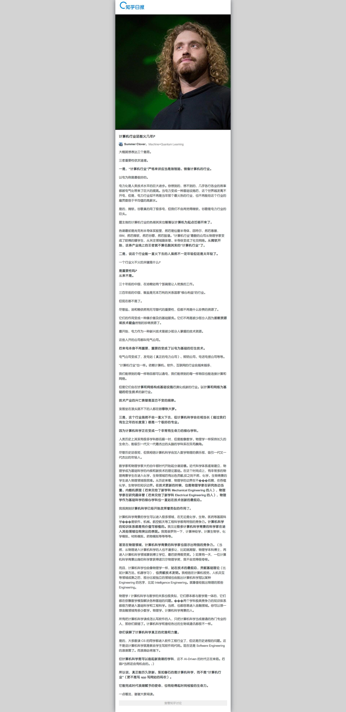

# 知乎日报

### 技术栈

+ vue + vue-route + vuex + vue-resource
+ lodash + moment.js + swiper
+ sass + normalize.css + flex

### To Do

+ 已完成 列表页、文章页面以及基本布局、返回首页、加载动画、轮播图控
+ 待开发 专栏、查看评论、顶部/侧边搜索
+ 优化 返回首页定位(根据id)、 过往消息列表缓存

### Dev

先安装依赖包
```nodejs
npm install
```

开启代理
```nodejs
cd zhihudaily/src/api

node server.js
```

webpack-server
```nodejs
npm run dev
```

[http://localhost:8080](http://localhost:8080)

有时候图会挂掉，因为知乎做了防外链，走的代理，不太稳定

### License

> 感谢[yanunon](https://github.com/yanunon/NeteaseCloudMusic/wiki/%E7%BD%91%E6%98%93%E4%BA%91%E9%9F%B3%E4%B9%90API%E5%88%86%E6%9E%90)提供的api，以及[yatessss](https://github.com/yatessss/zhihudaily-vue)的图片代理解决方案


### show


